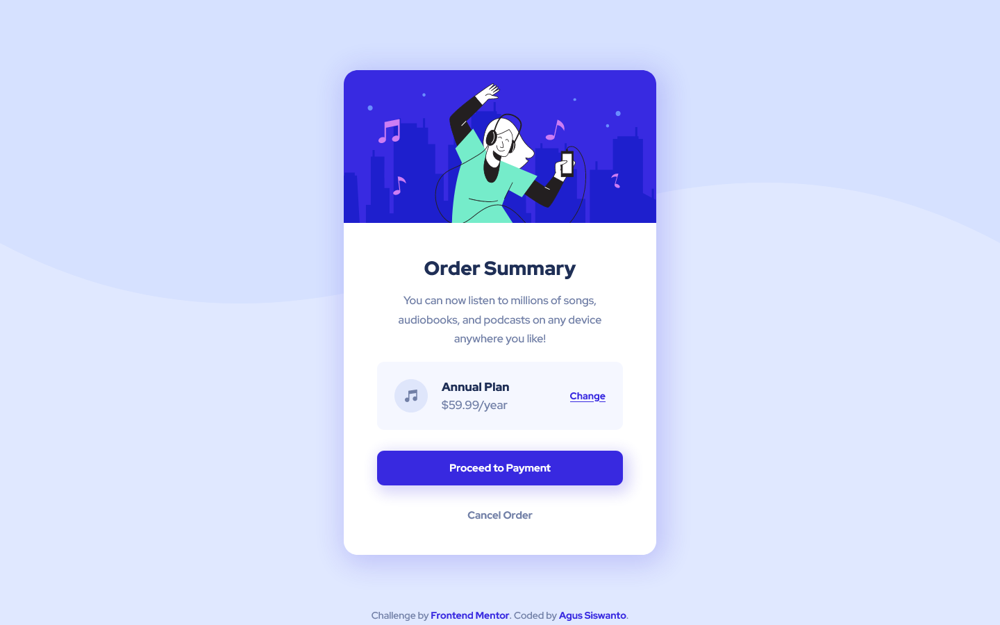

# Frontend Mentor - Order summary card solution

This is a solution to the [Order summary card challenge on Frontend Mentor](https://www.frontendmentor.io/challenges/order-summary-component-QlPmajDUj). Frontend Mentor challenges help you improve your coding skills by building realistic projects.

## Table of contents

- [Frontend Mentor - Order summary card solution](#frontend-mentor---order-summary-card-solution)
  - [Table of contents](#table-of-contents)
  - [Overview](#overview)
    - [The challenge](#the-challenge)
    - [Screenshot](#screenshot)
    - [Links](#links)
  - [My process](#my-process)
    - [Built with](#built-with)
  - [Author](#author)

## Overview

### The challenge

Users should be able to:

- See hover states for interactive elements

### Screenshot

### Links

- Solution URL: [Frontend Mentor Challenge Solution](https://www.frontendmentor.io/solutions/order-summary-component-using-grid-flexbox-sass-and-bem-ZWjl8G4t0w)
- Live Site URL: [Order Summary Card](https://fem-order-summary-component-good.netlify.app/)

## My process

### Built with

- Semantic HTML5 markup
- SCSS/SASS
- Flexbox
- CSS Grid
- Mobile-first workflow
- NPM Package dev dependency: vite, sass & autoprefixer for crossbrowser compatibility.

## Author

- Frontend Mentor - [@siswantodev](https://www.frontendmentor.io/profile/siswantodev)
